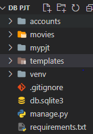
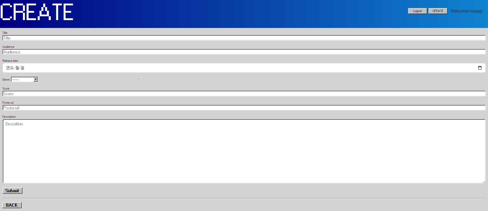
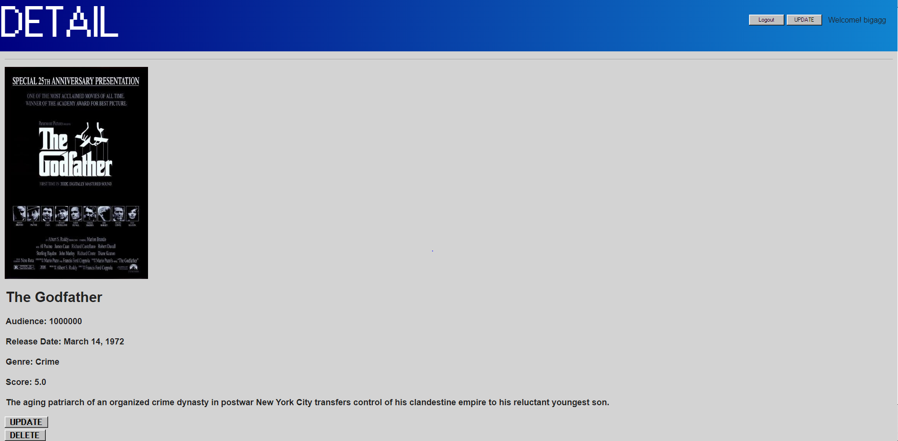
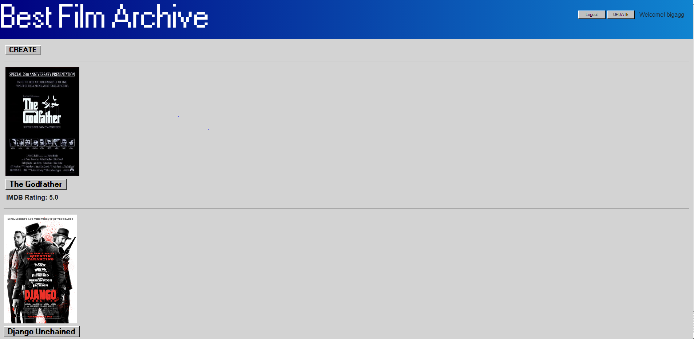
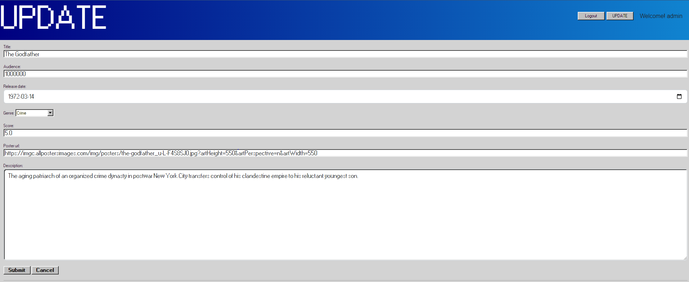
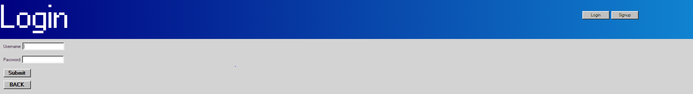
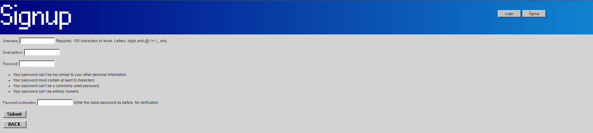
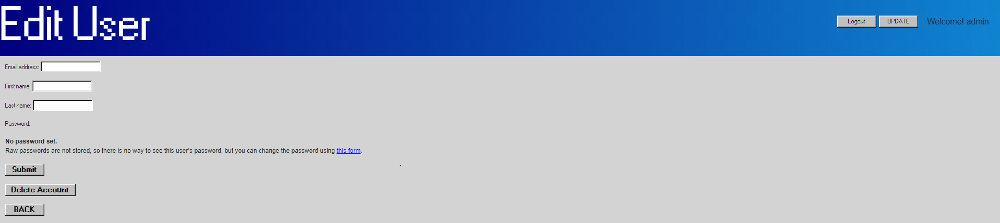

# PJT 05

### 이번 pjt 를 통해 배운 내용

* 예전에 했던 장고보다 조금더 advanced한 방법으로 접근하는것을 배웠다.

* 실습으로만 헀던 login과 유저관련 기능들을 구현하는 기회였다.


## A. 공통요구사항

* 커뮤니티 웹 서비스의 데이터 구성 단계입니다.

* 영화 데이터의 생성, 조회, 수정, 삭제가 가능한 애플리케이션을 완성합니다. 

* Django 프로젝트의 이름은 mypjt, 앱 이름은 movies로 지정합니다.

* .gitignore 파일을 추가하여 불필요한 파일 및 폴더는 제출하지 않도록 합니다. 

* 명시된 요구사항 이외에는 자유롭게 작성해도 무관합니다.

  ```python
  /venv/
  ```

  

  

  * 이 문제에서 어려웠던점: 공통 요구 사항에서의 어려움은없었다
  * 내가 생각하는 이 문제의 포인트: 장고를 설정하고 프로젝트, 앱을 구성할줄아는지 중요하다


# B. Model


```py
from random import choices
from django.db import models
from django.conf import settings
# Create your models here.

class Movie(models.Model):
    user = models.ForeignKey(settings.AUTH_USER_MODEL, on_delete=models.CASCADE)
    title = models.CharField(max_length=20)
    audience = models.IntegerField()
    release_date = models.DateField(auto_now_add=False)
    genre_Choice = (('Comedy','Comedy'),('Action','Action'),('Romance','Romance'),('Adventure','Adventure'),('Crime','Crime'),('War','War'),('Drama','Drama'),('Horror','Horror'),('Science Fiction ','Science Fiction '),('Musicals','Musicals'),('Historical','Historical'))
    genre = models.CharField(max_length=20, choices=genre_Choice)
    score = models.FloatField()
    poster_url = models.TextField()
    description = models.TextField()

    # def __str__(self):
    #     return self.title
```

이전 모델과 달리 몇몇 모델들은 form에서 위젲으로 구성해 주어야해서 힘들었다.

모델을 통해 어떤 데이터들을 받을지 테이블을 구성할줄알아야한다.

# C. URL

movies

```python
from django.urls import path
from . import views

app_name = 'movies'
urlpatterns = [
    path('', views.index, name='index'),
    path('create/', views.create, name='create'),
    path('<int:pk>/', views.detail, name='detail'),
    path('<int:pk>/update', views.update, name='update'),
    path('<int:pk>/delete', views.delete, name='delete'),
]

```

accounts

```python
from django.urls import path
from . import views

app_name = 'accounts'
urlpatterns = [
    path('login/', views.login, name='login'),
    path('logout/', views.logout, name='logout'),
    path('signup/', views.signup, name='signup'),
    path('delete/', views.delete, name='delete'),
    path('update/', views.update, name='update'),
    # path('password/', views.change_password, name='change_password'),
] 
```

mypjt

```python
from django.contrib import admin
from django.urls import path, include

urlpatterns = [
    path('admin/', admin.site.urls),
    path('movies/', include('movies.urls')),
    path('accounts/', include('accounts.urls')),
]
```

path와 include에 대한 개념은 정리되어 있어서 어렵지 않았다.

path와 include에 대한 개념정리가 잘되있어야 편하게 작성 할수있는거 같다.


# D. View

movies

```python
from django.shortcuts import render, redirect
from .models import Movie, Comment
from .forms import MovieForm, CommentForm
from django.contrib.auth.decorators import login_required
from django.views.decorators.http import require_http_methods,require_POST

# Create your views here.

def index(request):
    movies = Movie.objects.all()
    context = {
        'movies': movies,
        'title': "Best Film Archive",
    }
    return render(request, 'movies/index.html', context)

@login_required
@require_http_methods(['GET', 'POST'])
def create(request):
    if request.method == 'POST':
        form = MovieForm(request.POST)
        if form.is_valid():
            movie = form.save(commit=False)
            movie.user = request.user
            movie.save()
            return redirect('movies:detail', movie.pk)
    else:
        form = MovieForm()
    context = {
        'form': form,
        'title': "CREATE",
    }
    return render(request, 'movies/create.html', context)


def detail(request, pk):
    movie = Movie.objects.get(pk=pk)
    comment_form = CommentForm()
    comments = movie.comment_set.all()
    context = {
        'movie': movie,
        'comment_form': comment_form,
        'comments': comments,
        'title': "DETAIL",
    }
    return render(request, 'movies/detail.html', context)


@login_required
@require_http_methods(['GET', 'POST'])
def update(request, pk):
    movie = Movie.objects.get(pk=pk)
    if request.user == movie.user:
        if request.method == 'POST':
            form = MovieForm(request.POST, instance = movie)
            if form.is_valid():
                form.save()
                return redirect('movies:detail', movie.pk)
        else:
            form = MovieForm(instance = movie)
    else:
        return redirect('movies:index')
    
    context ={
        'form': form,
        'movie': movie,
        'title': "UPDATE",
    }
    return render(request, 'movies/update.html', context)

@login_required
@require_POST
def delete(request, pk):
    movie = Movie.objects.get(pk=pk)
    if request.user.is_authenticated:
        if request.user == movie.user:
            movie.delete()
            return redirect('movies:index')
    return redirect('movies:detail', movie.pk)
```

accounts

```python
from django.shortcuts import render, redirect
from django.contrib.auth import login as auth_login
from django.contrib.auth import logout as auth_logout
from django.contrib.auth import update_session_auth_hash
from django.contrib.auth.decorators import login_required
from django.contrib.auth.forms import AuthenticationForm
from django.views.decorators.http import require_http_methods, require_POST
from .forms import CustomUserChangeForm, CustomUserCreationForm
# Create your views here.

@require_http_methods(['GET', 'POST'])
def login(request):
    if request.user.is_authenticated:
        return redirect('movies:index')

    if request.method == 'POST':
        form = AuthenticationForm(request, request.POST)

        if form.is_valid():
            #로그인
            auth_login(request, form.get_user())
            return redirect(request.GET.get('next') or 'movies:index')
    else:
        form = AuthenticationForm()
    context = {
        'form': form,
        'title': 'Login'
    }
    return render(request, 'accounts/login.html', context)

@require_POST
def logout(request):
    if request.user.is_authenticated:
        auth_logout(request)
    return redirect('movies:index')


@require_http_methods(['GET', 'POST'])
def signup(request):
    if request.user.is_authenticated:
        return redirect('movies:index')
        
    if request.method == 'POST':
        form = CustomUserCreationForm(request.POST)
        if form.is_valid():
            user = form.save()
            # 회원가입 후 로그인
            auth_login(request, user)
            return redirect('movies:index')
    else:
        form = CustomUserCreationForm()
    context = {
        'form': form,
        'title': 'Signup'
    }
    return render(request, 'accounts/signup.html', context)

@require_POST
def delete(request):
    if request.user.is_authenticated:
        request.user.delete()
        auth_logout(request)
    return redirect('movies:index')


@login_required
@require_http_methods(['GET', 'POST'])
def update(request):
    if request.method == 'POST':
        form = CustomUserChangeForm(request.POST, instance=request.user)
        # form = CustomUserChangeForm(data=request.POST, instance=request.user)
        if form.is_valid():
            form.save()
            return redirect('movies:index')
    else:
        form = CustomUserChangeForm(instance=request.user)
    context = {
        'form': form,
        'title': 'Edit User'
    }
    return render(request, 'accounts/update.html', context)
```

아무래도 view함수가 장고가 작동하게 하는 논리 구조의 정수여서 시간을 많이 쓰게 하였다.

구조를 이해하고 기억하고 짜는 것이 제일 중요한거 같다.

# E. Admin

movies

```python
from django.contrib import admin
from .models import Movie, Comment
# Register your models here.

admin.site.register(Movie)
admin.site.register(Comment)
```

accounts

```python
from django.contrib import admin
from django.contrib.auth.admin import UserAdmin
from .models import User
# Register your models here.

admin.site.register(User, UserAdmin)
```

어드민에서 영화목록을 수정할수 있게 어드민 사이트에 등록해주는 과정이라 어렵진 않았다.

관리자 페이지 에서 한눈에 다 보고 수정할수 있게 해주는거기 때문에 장기적으로 중요한 기능 같았다.

# F. Form

movies

```python
from django import forms
from .models import Movie, Comment

class MovieForm(forms.ModelForm):

    title = forms.CharField(widget=forms.TextInput(attrs={'class':'form-control','placeholder':'Title'}))
    audience = forms.CharField(widget=forms.TextInput(attrs={'class':'form-control','placeholder':'Audience'}))
    score = forms.FloatField(required=False, max_value=5,min_value=0, 
        widget=forms.NumberInput(attrs={'id':'form_homework', 'step':"0.5", 'placeholder':'Score', 'class':'form-control'}))
    poster_url = forms.CharField(widget=forms.TextInput(attrs={'placeholder':'Poster url', 'class':'form-control'}))
    description = forms.CharField(widget=forms.Textarea(attrs={'class':'form-control', 'placeholder':'Descrition'}))
    release_date = forms.DateField(
        widget=forms.DateInput(
            attrs = {
                'class':'form-control', 
                'placeholder':'Select a date', 
                'type':'date',
            }
        )
    )   
    
    class Meta:
        model = Movie
        fields = '__all__'
        exclude = ('user',)
        

```

accounts

```python
from django.contrib.auth import get_user_model
from django.contrib.auth.forms import UserCreationForm, UserChangeForm

class CustomUserCreationForm(UserCreationForm):

    class Meta(UserCreationForm.Meta):
        model = get_user_model()
        fields = UserCreationForm.Meta.fields + ('email',)


class CustomUserChangeForm(UserChangeForm):

    class Meta(UserChangeForm.Meta):
        model = get_user_model()
        fields = ('email', 'first_name', 'last_name',)
```

모델폼에서 위젯을 이용하여 입력 받는 부분에 제약을 설정해주는 과정이라 쉽지 않았다.

모델의 필드 설정 과 함께 매우 중요한 부분이라고 느꼈다.

# G. Template

base

```html
<!DOCTYPE html>
<html lang="en">
<head>
    <meta charset="UTF-8">
    <meta http-equiv="X-UA-Compatible" content="IE=edge">
    <meta name="viewport" content="width=device-width, initial-scale=1.0">
    <title>Film World</title>
    <link href="https://cdn.jsdelivr.net/npm/bootstrap@5.2.0/dist/css/bootstrap.min.css" rel="stylesheet" integrity="sha384-gH2yIJqKdNHPEq0n4Mqa/HGKIhSkIHeL5AyhkYV8i59U5AR6csBvApHHNl/vI1Bx" crossorigin="anonymous"> 
    <link rel="stylesheet" href="https://unpkg.com/98.css" />
    <style>
        body {
            background-color: lightgrey;
        }

        .top {
          color: black; text-decoration-line: none; position: fixed; font-size: 0.7rem;
        }

    </style>
</head>
<body>
  
    <div class="title-bar">
        <div class="title-bar-text" style = "text-align: center; color: white;">
          <div class="d-flex justify-content-center">
            <h1>{{ title }}</h1>
          </div>
        </div>
      </div>
        
        
        <div style="right: 1.5rem; top: 2rem; position: fixed; font-size: 1rem;">
         Welcome! {{ user }}
        </div>
          <form action="" method="POST" style="right:15rem; top: 2rem; position: fixed; font-size: 0.7rem;">
            
            <input type="submit" value="Logout">
          </form>
          
          <button type="button" onclick = "location.href = ''" style="color: black; text-decoration-line: none; right:10rem; top: 2rem; position: fixed; font-size: 0.7rem;">UPDATE</button>
        

        <button type="button" onclick = "location.href = ''" class = top style="right:15rem; top: 2rem; ">Login</button>
        <button type="button" onclick = "location.href = ''" class = top style="right:10rem; top: 2rem; ">Signup</button>
         
        
        
    <div style = "margin: 10px;">
    
    
    </div>

    <script src="https://cdn.jsdelivr.net/npm/bootstrap@5.2.0/dist/js/bootstrap.bundle.min.js" integrity="sha384-A3rJD856KowSb7dwlZdYEkO39Gagi7vIsF0jrRAoQmDKKtQBHUuLZ9AsSv4jD4Xa" crossorigin="anonymous"></script>
</body>
</html>
```


movies/create

```html



<form action="" method="POST">
    
    {{ form.as_p }}
    <input type="submit" value='Submit' style="color: black; text-decoration-line: none; font-size: 16px; font-weight: bold;">
</form>
<hr>
<button type="button" onclick = "location.href = ''"><a style="color: black; text-decoration-line: none; font-size: 16px; font-weight: bold; padding-bottom: 20px" href = "">BACK</a></button><br>


```




movies/detail

```html



<hr>

    
<p>
    <div style="font-weight: bold; margin-left: 2px; font-size: 18px;">
<p style="font-weight: bold; font-size: 30px;">{{ movie.title }}</p>
<p>Audience: {{ movie.audience }}</p>
<p>Release Date: {{ movie.release_date }}</p>
<p>Genre: {{ movie.genre }}</p>
<p>Score: {{ movie.score }}</p>
<p>{{ movie.description }}</p>
    </div>

    <button type="button" onclick = "location.href = ''" style="color: black; text-decoration-line: none; font-size: 16px; font-weight: bold;">UPDATE</button>
<form action= "" method="POST">
    
    <input style='font-size: 16px; font-weight: bold;' class="mt-1" type='submit' value='DELETE'>
</form>

<hr>
<button type="button" onclick = "location.href = ''" style="color: black; text-decoration-line: none; font-size: 16px; font-weight: bold;">BACK</button>



```




movies/index

```html




<button class="mt-2" style="margin-left: 4px; text-decoration-line: none; color: black; font-weight: bold; font-size: 18px;" type="button" onclick = "location.href = ''">CREATE</button>
<hr>
<div style = "margin-left: 5px;">

<br>
<button class="mt-2" type="button" onclick = "location.href = ''"><a style="font-weight: bold; font-size: 20px; color: black; text-decoration-line: none;">{{ movie.title }}</a></button>
<p  class="mt-2" style="font-weight: bold; margin-left: 2px; font-size: 18px;"> IMDB Rating: {{ movie.score }} </p>
</div>
<hr>



```




movies/update

```html




<form action="" method="POST">
    
    {{ form.as_p }}
    <input type="submit" value='Submit' style="color: black; text-decoration-line: none; font-size: 14px; font-weight: bold;">
    <input type="submit" value='Cancel' style="color: black; text-decoration-line: none; font-size: 14px; font-weight: bold;">
</form>
<hr>

```




accounts/login

```html



  
  <form action="" method="POST">
    
    {{ form.as_p }}
    <input type="submit" value="Submit" style="color: black; text-decoration-line: none; font-size: 14px; font-weight: bold;">
  </form>
  <button type="button" onclick = "location.href = ''" style="color: black; text-decoration-line: none; font-size: 14px; font-weight: bold; margin-top:10px;">BACK</button>


```




accounts/signup

```html



  
  <form action="" method="POST">
    
    {{ form.as_p }}
    <input type="submit" value="Submit" style="color: black; text-decoration-line: none; font-size: 14px; font-weight: bold;">
  </form>

  <button type="button" onclick = "location.href = ''" style="color: black; text-decoration-line: none; font-size: 14px; font-weight: bold; margin-top: 10px;">BACK</button>

```




accounts/update

```html



  
  <form action="" method="POST">
    
    {{ form.as_p }}
    <input type="submit" value="Submit" style="color: black; text-decoration-line: none; font-size: 14px; font-weight: bold;">
  </form>
  <p>
  <form action="" method="POST">
    
    <input type="submit" value="Delete Account" style="color: black; text-decoration-line: none; font-size: 14px; font-weight: bold;">
  </form>

  <button style="margin-top: 15px;" type="button" onclick = "location.href = ''"><a style="color: black; text-decoration-line: none; font-size: 14px; font-weight: bold;" href = "">BACK</a></button>


```



한번 베이스 템프릿에 설정해놓으니 후에 템플릿들에 설정하는 것은 어렵지 않았다 그러나 처음 틀을 구축하는게 까다로웠고 시간이 많이 소요되었다.

베이스로 부터 상속받는 시스템을 잘 이용하여 보기 쉽고 잘 정리된 구조를 짜는게 중요한것 같았다.


# 후기

* 오늘 프로젝트는 쉬워 보였지만 나의 착각이었다, 생각보다 고려할 내용들이 많았다. 그래도 너무 재밌었다!
* 무엇보다 의욕이 너무 앞선 나머지 디테일 페이지 밑에 코멘트를 설정하고 싶었지만 시간이 부족하여 아쉬웠다.
* 주말에 다시한번 더 발전된 형태로 만들어봐야겠다!
